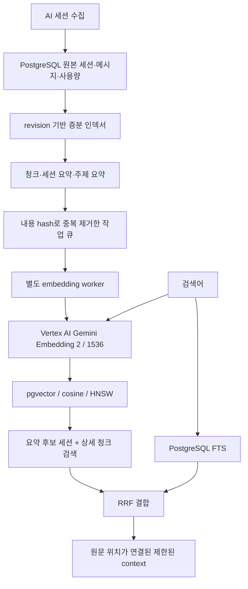

# AI 대화 검색·임베딩

## 현황과 판단

2026-09-17 공유 DB 읽기 전용 검사: 591 sessions, 35,059 messages (4,286 user / 30,773 assistant), 저장 본문 18,913,318자 / 25,880,880 bytes. 메시지 테이블·TOAST·인덱스 합계 43,827,200 bytes. 수집 중이므로 수치는 계속 변한다. `chars`는 원천 문자 통계이고 실제 마스킹된 DB 본문 길이와 다를 수 있다. 약 94억 사용 토큰은 캐시 반복 소비량을 포함하며 고유 저장 데이터 크기가 아니다.

기존 구조는 PostgreSQL + Prisma schema + `pg` SQL 저장소, USER/ASSISTANT 본문만 수집, 부분 문자열 ILIKE 검색과 시간 커서 페이지네이션이다. 기존 FTS/벡터/Elasticsearch는 없었다. 이 규모에서는 PostgreSQL로 저장·검색을 통합한다. Elasticsearch/OpenSearch는 도입하지 않는다. 향후 수백만~수천만 메시지나 독립 검색 서비스에서 실제 지연·운영 요구를 측정해 재검토한다.

## 데이터와 생성 경로



- `ai_ops_session.search_revision`: 본문·역할·모델·시각·제목·cwd 변경을 감지하는 SQL trigger. Usage 증가만으로 재생성하지 않는다. 기존 ingest ACK와 원문 트랜잭션에는 외부 호출이나 chunk 작업을 넣지 않는다.
- `ai_ops_search_state`: 세션별 indexed revision / chunk algorithm version. 세션 단위 트랜잭션 성공 후 갱신한다. 중단 시 마지막 미완료 세션부터 재개한다.
- `ai_ops_search_document`: CHUNK / SESSION_SUMMARY / TOPIC_SUMMARY를 하나의 검색 문서 모델로 관리. 원본 session/message FK, 청크 순서, 본문·제목·hash·문자 길이·유형·중요도·정책·원문 UTF-16 offset을 저장한다. 원문은 대체하지 않는다.
- `ai_ops_embedding_profile`: provider/model/dimensions/version/input_version으로 embedding space를 식별한다. 교체 모델은 새 profile로 공존한다.
- `ai_ops_embedding_job`: profile + SHA-256(title, content)를 PK로 사용한 durable job/cache. PENDING → PROCESSING → SUCCESS 또는 FAILED. 성공한 내용은 재import·재chunk 후에도 다시 호출하지 않는다. 제목도 API 입력이므로 hash에 포함한다.
- `ai_ops_document_embedding`: 검색 문서와 profile별 content-addressed 결과의 연결. 같은 내용의 여러 문서가 벡터를 재사용한다.
- `ai_ops_embedding_vector`: 선택 활성화되는 SQL 소유 테이블. 가변 `vector` + dimension CHECK + profile/dimension FK. 기본 1536차원은 partial expression HNSW `vector_cosine_ops`; 3072는 저장 및 exact cosine 비교가 가능하지만 ANN 최적화는 하지 않는다. Prisma만으로 이 테이블을 재생성하지 않는다.

재수집은 안정적인 메시지 ID로 중복을 제거한다. 현재 수집기는 이미 저장된 본문을
수정본으로 덮어쓰지 않고, 기존 본문이 NULL인 경우만 복원한다. 따라서 "원문이
달라졌으면 UPDATE"하는 수정 동기화 기능과는 구별해야 한다. 실제 DB의 본문이
변경되거나 메시지가 추가되면 revision 인덱서가 파생 문서를 다시 만들며,
같은 profile + SHA-256(title, content)의 성공 임베딩은 재사용한다.

## 검색 정책과 chunking

USER/ASSISTANT 대화와 코드 설명을 우선한다. usage/cache/system은 의미 검색에서 제외한다. 현재 raw tool/system/reasoning 수집 금지는 그대로다. 향후 승인된 tool 수집에는 정책 함수를 재사용할 수 있지만 이번 변경으로 도구 원문 수집을 확대하지 않는다.

기계적 로그는 줄 패턴과 비율로 식별해 기본 embedding을 끈다. 중요한 error/exception/failed/오류 문맥은 낮은 중요도로 포함한다. 이 규칙은 휴리스틱이며 실제 평가셋으로 조정해야 한다. 원본 및 명시적 부분 문자열/키워드 검색에서는 기록을 지우지 않는다.

청크는 문단·줄 경계를 우선하고 긴 코드/단일 줄은 UTF-8 6,000 bytes 이하로 나눈다. Unicode code point 중간을 자르지 않는다. 원문 offset은 JS UTF-16 인덱스이며 DB char_length와 구별한다. 토큰 수를 문자 수로 가장하지 않는다. 제목은 512 bytes 이하, 전체 API 입력은 8,000 bytes 이하로 제한해 문서의 8,192-token 창 내에서 보수적으로 처리한다.

요약은 초기 구현에서 **추출식**이다. 12개 유효 청크마다 발췌를 모아 TOPIC_SUMMARY를 만들고, 주제 구간을 골고루 선택해 SESSION_SUMMARY를 만든다. 원문 message/document ID를 남긴다. LLM이 이해·재서술한 요약이나 자동 주제 분류라고 주장하지 않는다. 장기 세션은 여러 topic summary로 덮는다. 고품질 추상식 요약은 별도 생성기를 붙이고 chunk/input version을 올려 비교할 수 있다.

## Provider와 Vertex AI

기본값:

```dotenv
EMBEDDING_PROVIDER=google
EMBEDDING_MODEL=gemini-embedding-2
EMBEDDING_DIMENSIONS=1536
EMBEDDING_VERSION=1
GOOGLE_CLOUD_PROJECT=<embedding 호출을 청구할 프로젝트>
GOOGLE_CLOUD_LOCATION=global
```

기존 환경변수 설정 방식을 사용한다. `@google/genai` 2.23.0을 설치하고 실제 SDK에서 Vertex `:embedContent`와 `us` multi-region endpoint 처리를 확인했다. ADC 또는 workload identity를 사용한다. 새 API key나 service-account key를 생성하지 않는다. OCI 앱/DB를 GCP로 이전하는 변경은 없다. compose는 비밀값이 아닌 embedding 설정을 앱 컨테이너에 전달한다. OCI에서 실행할 때는 서비스용 WIF 등 적절한 ADC를 별도로 구성해야 한다. GOOGLE_APPLICATION_CREDENTIALS를 쓴다면 credential 설정 파일과 그 원천을 별도 승인된 read-only mount/identity 경로로 제공해야 한다. 경로 변수만 설정해서는 인증이 되지 않는다. 개인 관리자 credential을 서버로 복사하지 않는다.

`EmbeddingProvider` 계약은 `config` 및 `embed(inputs, role)`의 순서 보존·항목별 성공/실패 결과다. 현재 구현체는 Google만 제공한다. 다른 provider는 이 계약과 factory에 등록한다. 미지원 provider/model은 명확히 실패하며 다른 모델로 몰래 대체하지 않는다.

Gemini Embedding 2는 `task_type`을 받지 않는다. 공식 retrieval 입력을 사용한다:

- Query: `task: search result | query: ...`
- Document: `title: ... | text: ...`

SDK 2.23.0 Vertex 경로는 request당 Content 하나만 지원한다. worker는 최대 4개 병렬 요청(상한 8)을 묶어 처리하며, 문서 여러 개를 하나의 embedding으로 합치지 않는다. Gemini Developer Batch API를 Vertex batch 지원으로 오인하지 않는다. 대규모 비동기 Vertex batch 지원이 확인되면 provider adapter 내부에서 확장한다.

외부 호출은 30초 제한. SDK 내부 재시도는 1 attempt로 제한하고 durable worker가 재시도한다. 429/5xx/timeout/네트워크 오류는 지수 backoff+jitter, 최대 5회. 400/401/403/404와 잘못된 차원·0/NaN/Infinity 벡터는 영구 실패로 저장한다. 오류에는 고정 코드만 보관하며 응답 본문·자격증명은 로그에 쓰지 않는다. 2분 lease와 token으로 늦은 worker 결과의 덮어쓰기를 막는다. API 성공 후 DB 저장 전에 죽으면 API 호출은 반복될 수 있지만 최종 벡터 저장은 멱등이다.

## 검색 흐름과 호환성

POST `/api/ai-ops/search`의 기존 인증 검증 뒤 실행한다. 읽기 요청에서 chunk/backfill을 시작하지 않는다.

- `mode: literal` 또는 생략: 기존 ILIKE 검색, `%`/`_`는 일반 문자, 시간 커서 페이지네이션 유지.
- `mode: keyword`: `simple` FTS + `websearch_to_tsquery`, rank/시간/ID 커서. 한국어 형태소 분석기가 아니므로 띄어쓰기·조사·부분 문자열에는 한계가 있다. literal 모드를 유지한다.
- `mode: hybrid`: query embedding → session/topic summary 후보 → 후보 세션 안의 청크 + 전역 청크 후보 → 전역 FTS 후보와 RRF. 자연어 문장의 기술 용어를 놓치지 않도록 FTS 후보는 OR lexeme를 사용하며 literal 일치도 보완한다. 전역 후보는 요약 불완전·백필 중의 recall을 보완한다. profile/revision/metadata filter를 적용하고 메시지 ID로 중복 제거한다. 결과는 관련도 Top-K이며 커서 페이지네이션은 하지 않는다.

반환 `context`는 session/message/document ID와 원문 범위가 붙은 인용이며 최대 16KB. LLM 호출·답변 생성은 이 변경에 포함하지 않는다. 원본 대화는 신뢰할 수 없는 참고 자료로 취급하고, 후속 LLM이 그 안의 지시를 시스템 명령으로 실행하지 않도록 한다.

pgvector 미활성, 현재 profile 미생성, provider 장애 시 키워드 결과와 `fallbackReason`을 반환하며 UI에 의미 검색 미사용을 표시한다. DB 쿼리 실패를 빈 성공으로 감추지 않는다. 벡터 변경 모델끼리 거리 계산하지 않는다.

## 적용·백필·운영

기존 운영 PostgreSQL에는 검사 시 vector 확장 파일이 없었다. 따라서 core migration과 vector 활성화를 분리한다. core migration은 기존 원문을 보존하고 FTS·파생 테이블·revision trigger만 만든다. FTS GIN 생성과 FK/column 추가는 lock/WAL을 발생시키므로 백업 후 승인된 반영 창에서 수행한다.

1. 공유 DB 읽기 전용 검사와 검증 가능한 백업.
2. 기존 배포 절차의 `prisma migrate deploy`로 core migration 적용. `migrate dev`/`db push` 금지.
3. DBA가 기존 PostgreSQL major version에 맞는 pgvector >=0.8 파일을 설치한 뒤 `scripts/sql/ai-ops-vector.sql`을 한 트랜잭션으로 적용. 원본 테이블이나 DB 컨테이너를 자동 교체하지 않는다.
4. GCP project/API/IAM/ADC 준비 후 아래 명령을 **명시적으로** 실행.

```bash
pnpm ai:search inspect
pnpm ai:search backfill --apply --batches 100
pnpm ai:search worker --apply --batches 100
pnpm ai:search inspect
pnpm ai:search retry --apply
```

`--apply` 없는 쓰기 명령은 상태만 출력한다. backfill은 API 호출 없이 한 번에 20 sessions의 파생 문서와 PENDING 작업을 준비한다. worker는 같은 증분 인덱서와 최대 4개 작업을 한 배치로 처리한다. PENDING 재시도 시각이 미래라면 종료하므로 cron/systemd 등으로 주기적으로 재실행한다. 영구 실패는 수동 retry 대상이다. OCI 운영에서는 아래 systemd timer를 설치해 자동 처리한다. 완료 기준은 현재 profile의 활성 job count에서 PENDING/PROCESSING/FAILED가 0이고 pendingSessions가 0인지 inspect로 확인하는 것이다. pendingSessions는 원문 revision 변경뿐 아니라 현재 profile 연결이 없는 세션도 포함한다. 원문이 바뀌어 더 이상 현재 문서에서 참조하지 않는 cache/job은 inactiveCount로 별도 표시하고 처리 대상에서 제외한다. 같은 내용이 다시 나타나면 재사용할 수 있도록 보존한다.

Mac에서 공유 DB를 대상으로 실행할 때는 기존 `pnpm db:shared -- node scripts/ai-ops-search.mjs ...` 터널 래퍼를 사용한다. 쓰기 실행은 별도 승인된 운영 절차에서만 한다. DB 자격증명을 로컬에 복사하지 않는다.

새 모델·차원·전처리 적용 시 새 profile/version으로 backfill하고 평가한 뒤 검색 설정을 전환한다. 이전 원문과 embedding profile은 보존한다. 검색 문서를 재생성해도 내용 hash가 같은 성공 job/vector는 재사용한다. vector 테이블만 재구축한 경우 worker가 누락된 SUCCESS vector를 다시 PENDING으로 바꿔 복구한다.

## OCI 서버 운영

OCI 상시 실행 구성은 `ops/ai-search/README.md`를 따른다. 서버는 개인 ADC 대신
OCI의 자동 갱신 인스턴스 인증서와 GCP X.509 WIF를 사용한다. 선택적
`docker-compose.wif.yml`과 systemd 인증서 갱신·embedding worker timer로 운영한다.
현재 운영 기본 호출 위치는 `global`이며 프로젝트 설정은 서버 환경변수로 유지한다.

## 평가

사용자가 직접 관련 세션을 판정한 작은 JSON 파일로 시작한다. 본문·실제 session ID가 담긴 평가 파일을 공개 Git에 커밋하지 않는다.

```json
[{"query":"OCI에서 nginx 구조 변경하려고 했던 내용","relevant":{"actual-session-id":2}}]
```

```bash
pnpm ai:search evaluate /private/path/ai-search-evaluation.json
```

동일 query set에 대해 profile 설정을 바꾸어 Recall@5, Recall@10, MRR, nDCG@10을 비교한다. 판정 점수는 0~3이다. fallback이면 평가를 실패 처리해 의미 검색 품질로 잘못 보고하지 않는다. 현재 실제 데이터에서 모델의 검색 품질을 측정했다는 뜻은 아니다. 3072는 exact 검색으로 먼저 비교하고 필요할 때 halfvec HNSW+full precision reranking을 검토한다.

## 공식 근거

- [Vertex Gemini Embedding 2 API·retrieval 입력·차원](https://docs.cloud.google.com/gemini-enterprise-agent-platform/models/embeddings/get-multimodal-embeddings)
- [Google Gen AI JavaScript SDK](https://googleapis.github.io/js-genai/release_docs/classes/models.Models.html#embedContent)
- [Gemini Embedding 입력 집계와 권장 차원](https://ai.google.dev/gemini-api/docs/embeddings)
- [pgvector HNSW·차원 제한·partial index](https://github.com/pgvector/pgvector)
- [PostgreSQL FTS](https://www.postgresql.org/docs/current/textsearch-controls.html)

## 검증 방법

```bash
node --experimental-strip-types --env-file-if-exists=.env --test lib/ai-ops/*.test.mjs lib/ai-ops/search/*.test.mjs
pnpm exec prisma validate
pnpm typecheck
pnpm build
```

DB 테스트는 `assertTestDatabase`로 localhost:5432/project_management_test만 허용하고 private schema + ROLLBACK으로 끝난다. pgvector 확장 파일이 없으면 벡터 통합 테스트는 SKIP한다. 별도 로컬 빌드가 있는 검증 환경에서는 `AI_OPS_TEST_VECTOR_SQL`로 공식 pgvector의 MODULE_PATHNAME을 빌드 경로로 치환한 설치 SQL을 전달할 수 있다. 이 경로도 같은 테스트 트랜잭션 안에서만 로드하며 서버 extension 디렉터리 설치나 재시작을 하지 않는다.

SDK wire 테스트는 실제 설치된 Google SDK에 가짜 auth/fetch를 주입해 요청 URL·본문과 응답 변환을 검사한다. 실제 Vertex IAM/모델 접근, 프로젝트 크레딧 적용, 실데이터 의미 검색 품질은 별도 운영 검증 대상이다.
